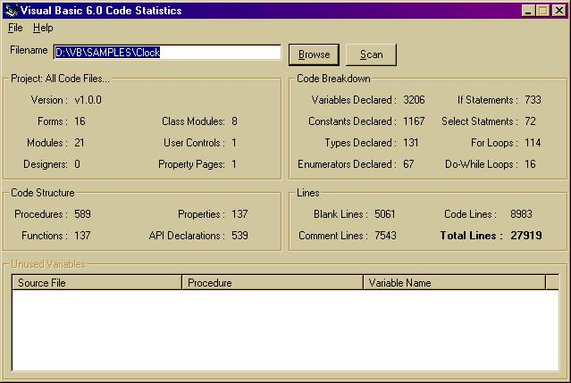



## Code Statistics and Unused Variable Finder v4\.3

### Description

This will scan your code for statistics like how many forms, classes, modules, user controls, property pages or designers you have but can also scan your code to pick out any unused variables/parameters in your code. The main difference between this and the previous version is that the program now scans all vb code file types (as far as I'm aware; frm, mod, cls, ctl, pag and dsr), the unused variable finder is now faster, you can scan an entire subdirectory/drive and also you can save your reports. As always, suggestions for improvements and votes are very welcome. Please let me know also if you encounter any problems. Thank you.
 
### More Info
 

             |
---                |---
**Submitted On**   |2002-09-20 17:58:48
**By**             |[Eric O'Sullivan](https://github.com/Planet-Source-Code/PSCIndex/blob/master/ByAuthor/eric-o-sullivan.md)
**Level**          |Advanced
**User Rating**    |4.8 (81 globes from 17 users)
**Compatibility**  |VB 6\.0
**Category**       |[Complete Applications](https://github.com/Planet-Source-Code/PSCIndex/blob/master/ByCategory/complete-applications__1-27.md)
**World**          |[Visual Basic](https://github.com/Planet-Source-Code/PSCIndex/blob/master/ByWorld/visual-basic.md)
**Archive File**   |[Code\_Stati1341369212002\.zip](https://github.com/Planet-Source-Code/eric-o-sullivan-code-statistics-and-unused-variable-finder-v4-3__1-39149/archive/master.zip)

